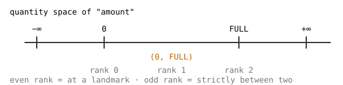

# 2. Quantities and values

> **In this lesson:** how the library represents a quantity when it refuses to
> use exact numbers — with *landmarks*, *intervals*, and a *direction*.

## Landmarks: the values that matter

When you reason about the bathtub, a few special water levels matter: *empty*
(zero) and *full* (the brim). Everything else is just "somewhere in between."
These special values are called **landmarks**.

A landmark is really just a **name**. It may optionally carry a number (we'll
use that in Lesson 8), but qualitative reasoning uses only the name and the
*order* of the landmarks.

```python
import qrlib as qr

empty = qr.Landmark("0")
full = qr.Landmark("FULL")
```

## Quantity spaces: landmarks in order

A **quantity space** is a list of landmarks in increasing order. It's the set
of qualitatively distinct values a variable can take. For the bathtub's water
`amount`, the space is just `0 < FULL`:

```python
space = qr.QuantitySpace((qr.Landmark("0"), qr.Landmark("FULL")))
# or, more briefly, using bare names:
space = qr.QuantitySpace(("0", "FULL"))
```

A value in this space is either *at* a landmark or *strictly between* two of
them. So `amount` can be:

- **at `0`** (empty),
- **in the interval `(0, FULL)`** (partly full),
- **at `FULL`** (brim-full).

Some quantities have no natural top or bottom — a net flow can be as positive
or as negative as you like. Mark those ends *unbounded*, which adds
conceptual `-inf` / `+inf` endpoints:

```python
netflow_space = qr.QuantitySpace(("0",), lower_unbounded=True, upper_unbounded=True)
# effective landmarks:  -inf < 0 < +inf
```

Here is the `amount` space drawn out. The library assigns each qualitative
value an integer **rank** — even ranks land *on* a landmark, odd ranks land
*between* two — so that "is this bigger?" becomes plain integer comparison:



You rarely touch ranks directly, but it's good to know the rule: **even = at a
landmark, odd = in an interval.**

```python
space = qr.QuantitySpace(("0", "FULL"))
print(space.rank_of("0"))            # 0  (at the first landmark)
print(space.rank_between("0", "FULL"))  # 1  (the interval between them)
print(space.rank_of("FULL"))         # 2  (at the second landmark)
print(space.describe(1))             # "(0, FULL)"
```

## Direction: which way it's moving

Knowing *where* a quantity is isn't enough; we also need to know *which way
it's heading*. That's the **qualitative direction** (`Qdir`), one of:

- `Qdir.INC` — increasing (↑)
- `Qdir.STD` — steady (·)
- `Qdir.DEC` — decreasing (↓)

(The library's `sign` of a direction is `-1`, `0`, `+1` — the same signs you'd
use by hand.)

## Putting it together: a qualitative value

A **qualitative value** (`QVal`) is a magnitude **and** a direction. "The tub
is partly full and filling" is the interval `(0, FULL)` paired with `INC`:

```python
from qrlib import Qdir, QVal

space = qr.QuantitySpace(("0", "FULL"))
partly_full_and_rising = QVal(space.rank_between("0", "FULL"), Qdir.INC)
print(partly_full_and_rising.describe(space))   # "(0, FULL)↑"
```

That little string — `(0, FULL)↑` — is the whole idea in miniature: an
*ordinal position* plus a *trend*. A complete snapshot of a system is just one
of these for every variable, which is what the next lessons assemble into a
**state**.

## Why this representation is the point

By throwing away exact numbers and keeping only landmarks, order, and
direction, we make the set of possible situations **finite and small**. The
bathtub's `amount` has exactly three qualitative magnitudes, not infinitely
many real ones. That finiteness is what lets the library enumerate *all*
behaviors in Lesson 4 — something impossible if every real number were a
distinct case.

## Exercises

1. Write the quantity space for the **angle of a pendulum** that swings
   between a leftmost and rightmost point through a center. How many
   qualitative magnitudes does it have? (Hint: name the three landmarks.)
2. Using `QuantitySpace` and `QVal`, build and `describe` the value "a
   temperature that is above freezing and falling," with landmarks
   `FREEZE < BOIL`.
3. A variable's space is `("0",)` with both ends unbounded. List its effective
   landmarks and say how many qualitative magnitudes it has. (Check yourself
   with `space.num_ranks`.)

---

Next: [**3. Constraints and models →**](03-constraints-and-models.md)
