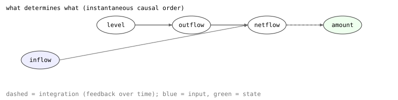

# 3. Constraints and models

> **In this lesson:** how to describe the way a system's parts relate — using
> a small vocabulary of *constraints* — and assemble them into a `Model`.

## A system is its relationships

The bathtub's behavior comes entirely from how its quantities relate:

- the **level** rises and falls with the **amount** of water;
- the **outflow** rises and falls with the **level** (deeper water drains
  faster);
- the **net flow** is the inflow minus the outflow;
- the **amount** changes at a rate equal to the net flow;
- the **inflow** is held constant.

Each of those is a *constraint*. Qualitative reasoning has a small, reusable
vocabulary for them.

## The constraint vocabulary

| Constraint | Meaning | Bathtub use |
|---|---|---|
| `MPlus(x, y)` | `y` increases whenever `x` does (some increasing function `y = f(x)`) | level ↔ amount, outflow ↔ level |
| `MMinus(x, y)` | `y` decreases whenever `x` increases | — |
| `Add(x, y, z)` | `x + y = z` | netflow + outflow = inflow |
| `Mult(x, y, z)` | `x · y = z` | — |
| `Minus(x, y)` | `y = -x` | — |
| `Deriv(x, y)` | `y` is the rate of change of `x` (`y = dx/dt`) | amount's rate is the netflow |
| `Constant(x)` | `x` never changes | inflow is fixed |

The two you'll meet most are `MPlus` and `Deriv`.

**`MPlus` (monotonically increasing)** is the workhorse. It says "these two
move together" *without committing to a formula*. `MPlus("amount", "level")`
means only that a deeper tub holds more water and vice versa — true whether
the relationship is linear, quadratic, or some messy real tub shape. That
looseness is exactly what lets one qualitative model stand for a whole family
of real systems.

**`Deriv` (integration)** connects a quantity to its rate. `Deriv("amount",
"netflow")` says the water amount rises when the net flow is positive, falls
when it's negative, and holds steady when it's zero — the qualitative version
of "integrate the net flow to get the amount."

## Corresponding values

Monotonic constraints can record landmark pairs known to line up. For the
bathtub, an empty tub has zero level, and a brim-full tub is at its top level:

```python
qr.MPlus("amount", "level", cvals=(("0", "0"), ("FULL", "TOP")))
```

Those `cvals` (corresponding values) say "when amount is `0`, level is `0`;
when amount is `FULL`, level is `TOP`." They pin the landmarks together so the
reasoning stays tight.

## Building the bathtub model

Now assemble it. A `Model` collects variables (each with its quantity space)
and constraints:

```python
import qrlib as qr
from qrlib import Qdir, TimeTag

m = qr.Model("bathtub")

# variables and their quantity spaces
m.variable("amount",  landmarks=("0", "FULL"))
m.variable("level",   landmarks=("0", "TOP"))
m.variable("outflow", landmarks=("0", "OMAX"))
m.variable("inflow",  landmarks=("0", "IF"))
m.variable("netflow", landmarks=("0",), unbounded=True)

# constraints: how the quantities relate
m.constrain(qr.MPlus("amount", "level",  cvals=(("0", "0"), ("FULL", "TOP"))))
m.constrain(qr.MPlus("level",  "outflow", cvals=(("0", "0"), ("TOP", "OMAX"))))
m.constrain(qr.Add("netflow", "outflow", "inflow"))   # netflow + outflow = inflow
m.constrain(qr.Deriv("amount", "netflow"))            # amount's rate is netflow
m.constrain(qr.Constant("inflow"))                    # the tap is fixed
```

That's the whole model. Note we never said *how much* water flows — only how
the quantities are wired together.

## The initial state

To simulate, we need a starting **state**: a qualitative value for every
variable at one instant. We start with an empty tub, tap just opened, so
everything is poised to rise and the net flow is positive but will fall as the
drain catches up:

```python
initial = m.state(
    time=TimeTag.POINT,
    amount=("0", Qdir.INC),                  # empty, rising
    level=("0", Qdir.INC),
    outflow=("0", Qdir.INC),
    inflow=("IF", Qdir.STD),                 # tap fixed at its rate
    netflow=(("0", "+inf"), Qdir.DEC),       # positive, but decreasing
)
```

Each value is either `(landmark, direction)` for an at-landmark value or
`((lower, upper), direction)` for an interval — here `netflow` starts in the
interval `(0, +inf)`.

## Seeing the structure

The constraints induce a *causal structure*: which quantity determines which.
The library can read this straight off the model (you'll meet `causal_order`
properly in Lesson 9), and it looks like this for the bathtub:



The **inflow** is an input (blue); the **amount** is the state variable
(green) that carries the system's memory; everything else is computed from
them at each instant. The dashed arrow is *integration* — the net flow feeds
back to change the amount over time, which is the loop that drives the whole
behavior.

## Exercises

1. Add a second drain to the bathtub: a variable `outflow2` that also rises
   with `level`, and fold it into the net-flow balance. Which constraints do
   you add or change? (Hint: you'll need the net flow to subtract *both*
   outflows.)
2. Explain in words what `MMinus("pressure", "volume")` asserts about a gas.
3. Why does the model use `Deriv("amount", "netflow")` rather than
   `Deriv("level", "netflow")`? (Which quantity is the one the net flow
   literally accumulates into?)

---

Next: [**4. Your first simulation →**](04-simulating.md)
