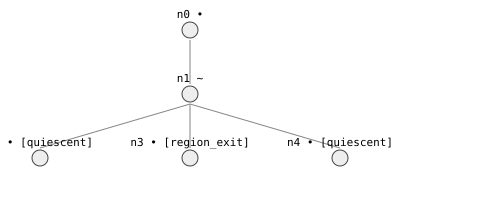

# 4. Your first simulation

> **In this lesson:** run `qsim`, read the tree of possible behaviors, and
> understand how each one ends.

## Running the simulation

With the model and initial state from Lesson 3, one call does the work:

```python
import qrlib as qr
from qrlib import Qdir, TimeTag

# ... build `m` and `initial` as in Lesson 3 ...

result = qr.qsim(m, initial)
print(result.status)                 # SimStatus.COMPLETE
print(len(result.behaviors()))       # 3
```

`qsim` explores **every** qualitatively consistent way the system can evolve
from the initial state, and returns a `SimResult`. The most useful piece is
`result.behaviors()` — the list of complete behaviors, each a path from the
start to an ending.

## The three bathtub behaviors

```python
for b in result.behaviors():
    print(b.terminal, "  in", len(b.states), "states")
```

```
TerminalClass.QUIESCENT     in 3 states
TerminalClass.QUIESCENT     in 3 states
TerminalClass.DOMAIN_EXIT   in 3 states
```

Three outcomes — exactly the ones you reasoned out by hand in Lesson 1:

1. the level settles **below** the brim (a quiescent equilibrium),
2. it settles **exactly at** the brim (another equilibrium),
3. it **overflows** — the water amount must leave the top of its quantity
   space, which the library reports as a `domain_exit` (the system has left
   the range the model describes).

Here is the whole behavior graph again, now that you know how to read it:



The root (top) is the initial state. It flows into one intermediate state,
which then **branches** into the three endings. Branching is the library
saying "from here, more than one future is qualitatively consistent."

## Terminal classes: how a behavior ends

Every behavior ends in a **terminal class** that tells you *why* it stopped:

| Terminal | Meaning |
|---|---|
| `QUIESCENT` | Everything went steady — an equilibrium. The system stays here forever. |
| `CYCLE` | The state repeats an earlier one — a loop (you'll see this with the spring in Lesson 5). |
| `DOMAIN_EXIT` | A variable must leave its quantity space (e.g. the tub overflows past `FULL`). |
| `REGION_EXIT` | A declared operating region is left without an applicable transition. |
| `DIVERGENT` | A variable runs off to infinity (the `t → ∞` limit). |
| `DEADEND` | No consistent successor survived — the state was *spurious*. Reported, never hidden. |
| `TRUNCATED` | A resource limit stopped exploration here (not a real ending — see Lesson 6). |

You can ask summary questions with the `analysis.queries` helpers:

```python
from qrlib.analysis import queries

census = queries.terminal_census(result.graph)
print(census)
# {TerminalClass.QUIESCENT: 2, TerminalClass.DOMAIN_EXIT: 1}
```

## Looking inside a behavior

A behavior is a sequence of states. You can inspect what each variable is
doing at each step:

```python
overflow = next(b for b in result.behaviors()
                if b.terminal is qr.TerminalClass.DOMAIN_EXIT)

for state in overflow.states:
    amount = state["amount"]
    space = m.variables["amount"].space
    print(space.describe(amount.mag), amount.dir.name)
```

```
0 INC
(0, FULL) INC
FULL INC
```

The overflow behavior: the amount starts at `0` rising, passes *through* the
interval `(0, FULL)`, and arrives *at* `FULL` still rising — which is why it
overflows. Read that last line as the punchline: **still increasing when it
hits the top means it can't stop, so it leaves the tub.**

## Determinism

Given the same model and configuration, `qsim` produces the *same* graph every
time — the ordering of behaviors and states is fixed and reproducible. You can
rely on that in tests and in figures.

## Exercises

1. Run the bathtub simulation and print, for each of the two `QUIESCENT`
   behaviors, the final direction of every variable. (They should all be
   steady — that's what "quiescent" means.)
2. The overflow behavior reaches `FULL` while still `INC`. What would it mean,
   physically, if a behavior reached `FULL` while `STD`? Which terminal class
   would that be instead?
3. Use `queries.terminal_census` on your two-drain model from Lesson 3's
   exercises. Did adding a drain change the set of possible outcomes?

---

Next: [**5. Cycles and the spring →**](05-cycles-and-the-spring.md)
