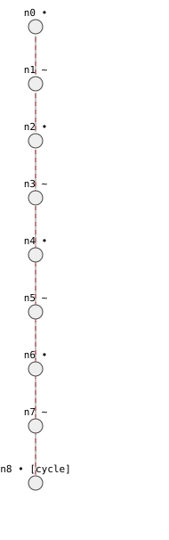
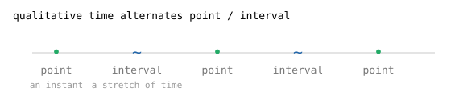
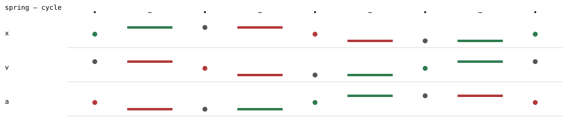

# 5. Cycles and the spring

> **In this lesson:** a system that loops forever, the alternation of *point*
> and *interval* time, and how to read a behavior as a timeline.

## A different kind of system

The bathtub settled down. Not everything does. A frictionless spring — a mass
bobbing on a spring with no friction — swings back and forth forever. Its
behavior isn't a tree that ends; it's a **loop**.

Here's the model. Position `x`, velocity `v`, and acceleration `a`, related by
the physics `x'' = -x` (the acceleration always points back toward center):

```python
import qrlib as qr
from qrlib import Qdir, TimeTag

m = qr.Model("spring")
for name in ("x", "v", "a"):
    m.variable(name, landmarks=("0",), unbounded=True)   # can be -, 0, or +

m.constrain(qr.Deriv("x", "v"))    # velocity is the rate of position
m.constrain(qr.Deriv("v", "a"))    # acceleration is the rate of velocity
m.constrain(qr.Minus("x", "a"))    # a = -x  (the restoring force)

initial = m.state(
    time=TimeTag.POINT,
    x=("0", Qdir.INC),            # at center, moving in the + direction
    v=(("0", "+inf"), Qdir.STD),  # at peak speed
    a=("0", Qdir.DEC),
)
```

The practical default keeps landmark discovery off (you'll meet the classic
alternative in Lesson 6):

```python
result = qr.qsim(m, initial)
(behavior,) = result.behaviors()
print(behavior.terminal)          # TerminalClass.CYCLE
print(len(behavior.states))       # 9
```

One behavior, and it's a `CYCLE` — it returns to a state it has already
visited and closes the loop.



Read it top to bottom: the state marches through the quarter-swings of one
full oscillation, and the dashed edge at the bottom loops back to the start.
That dashed line is the library saying "and then it repeats, forever."

## Point time and interval time

Look closely at the states and you'll notice they alternate between two kinds
of time. This is fundamental to how QSIM represents change:



- A **point** (•) is an *instant* — a distinguished moment, like the exact
  instant the spring reaches its rightmost point and its velocity is zero.
- An **interval** (~) is a *stretch of time* between two instants — like the
  whole sweep from center to the rightmost point.

Time alternates point, interval, point, interval… because the interesting
things (reaching a landmark, a direction reversing) happen at instants, and
between them the system just *moves* through a stretch. A state's
`time` tag tells you which it is:

```python
from qrlib import TimeTag
for i, state in enumerate(behavior.states):
    kind = "•" if state.time is TimeTag.POINT else "~"
    print(i, kind)
```

## Reading a behavior as a timeline

The graph shows the *branching structure*; a **timeline** shows what each
variable *does along one behavior*. The library renders one directly:

```python
from qrlib.viz import timeline_svg
svg = timeline_svg(result.graph, behavior)
assert svg.startswith("<svg")
```

Notebook and host applications can display or persist the returned string.
Here is the committed rendering:



Each row is a variable; each column is a state (• point, ~ interval). The
height of a mark is the variable's magnitude, and its colour is its direction
(red falling, green/grey steady, blue rising). Trace the `x` row and you'll
see the classic shape of an oscillation: up to a peak, back through center to
a trough, and back — one full period, then the cycle closes.

## Finding cycles programmatically

You don't have to eyeball it. The query helpers locate loops for you:

```python
from qrlib.analysis import queries
loops = queries.cycles(result.graph)
print(len(loops))        # 1
print(len(loops[0]))     # 9  — the states in the loop
```

The query works in either representation: tree simulations record a
`cycle_target`, while attainable-envisionment simulations encode recurrence
as graph edges and the query extracts one concrete loop from each recurrent
strongly connected component.

## Exercises

1. Run the spring and print the `x` value (magnitude and direction) at every
   state. Identify which state is the rightmost point of the swing (where `x`
   is at its most positive and `v` has just become zero).
2. The velocity `v` passes through zero twice per period. At those two
   instants, what is the position `x` doing? (Use the timeline or the printed
   states.)
3. A pendulum with friction slowly loses amplitude and eventually stops. Would
   you expect its behavior graph to end in a `CYCLE` or a `QUIESCENT` state?
   Why?

---

Next: [**6. Taming spurious behaviors →**](06-spurious-behaviors.md)
