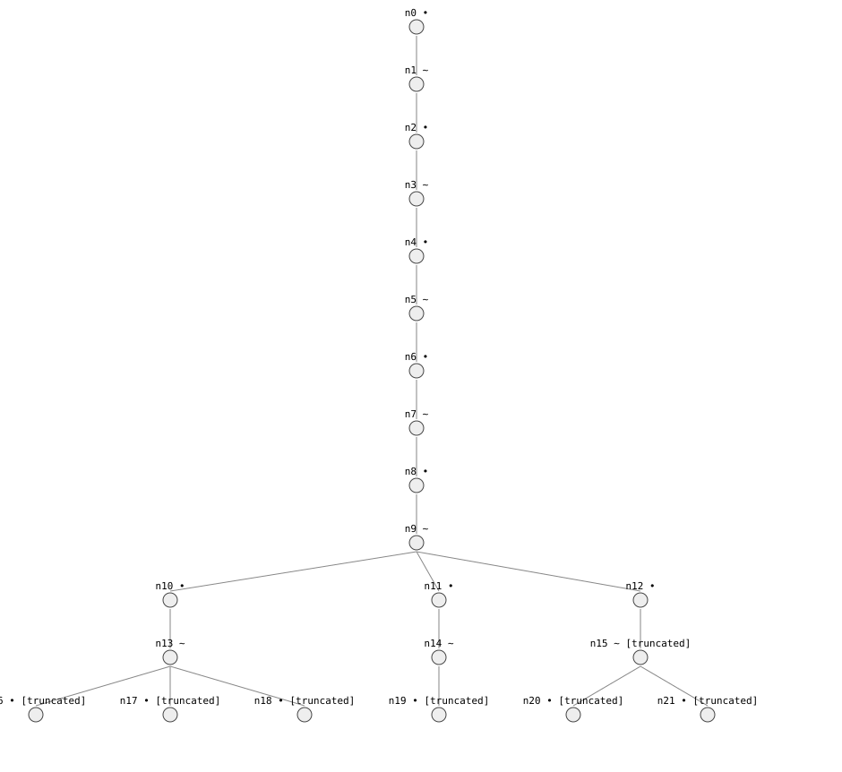
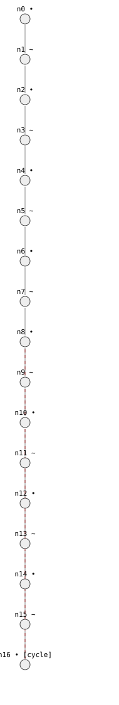

# 6. Taming spurious behaviors

> **In this lesson:** why the honest answer is sometimes a mess, where the mess
> comes from, and how to soundly clean it up.

## The promise, revisited

Lesson 1 warned that the library's output can contain *spurious* behaviors —
extra paths no real system follows. Now we meet them head-on, because the
frictionless spring is where they famously appear.

In Lesson 5 we ran the spring with `discover_landmarks=False` and got one
clean cycle. Turn discovery on (the default) and watch what happens:

```python
import qrlib as qr
# ... spring model `m`, `initial` as in Lesson 5 ...

result = qr.qsim(m, initial, max_states=22)   # cap the work; see why below
print(result.status)          # SimStatus.TRUNCATED  — it didn't finish!
print(len(result.behaviors()))
```



That sprawling tree is a genuine problem. The real frictionless spring has
*one* behavior — a steady oscillation. Where did all these come from?

## Where the mess comes from: landmark discovery

**Landmark discovery** is a powerful feature: when a variable goes steady at a
value that has no name yet — like the exact height of the spring's first peak
— the library *invents* a landmark for it (`x*0`, `x*1`, …) so it can reason
about later peaks *relative to* it.

But here's the rub. When the spring reaches its second peak, is that peak
**higher than**, **equal to**, or **lower than** the first? Pure qualitative
reasoning can't tell — all three are consistent with "a spring swings back and
forth." So it branches three ways. And again at the next peak. And the next.
The result is the explosion above: spurious *growing* and *shrinking*
oscillations that no real frictionless spring exhibits, plus unbounded
invention of new landmarks (which is why we had to cap it with `max_states`).

This is the coverage guarantee being scrupulously honest: it will not *rule
out* the growing oscillation, because nothing in the bare qualitative model
forbids it. To rule it out, we must *add knowledge*.

## Cleaning up soundly: the energy argument

The knowledge we're missing is **energy conservation**. A frictionless spring
keeps the same energy, so it must return to the *same* amplitude every swing —
it cannot spontaneously grow or shrink. That single physical fact collapses
the whole mess.

The library ships this as a ready-made filter, `EnergyFilter`:

```python
tamed = qr.qsim(m, initial,
                config=qr.SimConfig(successor_filters=(qr.EnergyFilter(),)))
print(tamed.status)              # SimStatus.COMPLETE
print(len(tamed.behaviors()))    # 1
```



One behavior — the true oscillation. The `EnergyFilter` enforces that turning
points don't drift: once the first peak is discovered, later peaks must match
it. Growing and shrinking swings are pruned as inconsistent with conservation.

`EnergyFilter` has two modes:

- `EnergyFilter()` — **conserved** (the default): amplitude is pinned, as for
  the frictionless spring.
- `EnergyFilter(trend="nonincreasing")` — **dissipative**: amplitude may
  *shrink* but never grow, as for a spring *with* friction.

A crucial point about soundness: a filter can only ever **remove** behaviors,
never invent them. So adding an energy argument can never break the coverage
guarantee — at worst a *wrong* energy claim would prune a real behavior, which
is your responsibility as the modeller, just like a wrong constraint.

## A second source of clutter: chatter

Sometimes a variable's *direction* wobbles meaninglessly — increasing,
decreasing, steady, back again — without anything observable depending on it.
This is called **chatter**, and it multiplies behaviors just like discovery
does. The library can detect chattering variables automatically and abstract
their direction away:

```python
result = qr.qsim(m, initial, config=qr.SimConfig(dynamic_chatter=True))
```

You'll see `dynamic_chatter=True` again in Lesson 9, where it lets a
two-tank model simulate that would otherwise drown in irrelevant wiggles.

## The takeaway

The bare qualitative model gives you *guaranteed coverage but maybe clutter*.
You then **add sound knowledge** — energy arguments, chatter abstraction — to
prune the clutter *without ever risking the guarantee*. That trade — coverage
first, precision through added knowledge — is the rhythm of working with this
library.

## Exercises

1. Run the spring three ways: discovery off; discovery on with a small
   `max_states`; and discovery on with `EnergyFilter()`. Record the status and
   behavior count of each. Which is the true answer, and why do the other two
   differ?
2. `EnergyFilter` can only remove behaviors. Explain why that means it can
   never cause the library to *miss* a real behavior — only, if misapplied,
   to wrongly discard one.
3. A ball bouncing on the floor loses a little height each bounce. Which
   `EnergyFilter` trend — `conserved` or `nonincreasing` — matches it?

---

Next: [**7. The soundness guarantee →**](07-soundness.md)
