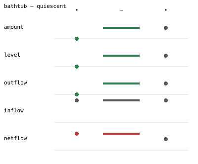

# 8. Adding numbers back

> **In this lesson:** when you *do* know some numbers, feed them in and get
> quantitative bounds back — "the outflow settles at exactly 2" — without
> giving up the qualitative guarantees.

## The middle ground

Pure qualitative reasoning uses no numbers; pure numerical simulation needs
*all* of them. Real problems live in between: you often know a few values (the
tap rate, a capacity) but not others (the exact drain shape). **Semi-quantitative
reasoning** takes whatever numbers you have and squeezes out the tightest
bounds it soundly can.

The key move is to give your landmarks numeric values. Recall that a
`Landmark` is a name that *may* carry a number. Attach numbers, and the
library can reason about magnitudes and even *time*, not just order.

```python
import qrlib as qr
from qrlib import Landmark, Qdir, TimeTag

m = qr.Model("bathtub")
m.variable("amount",  landmarks=(Landmark("0", 0.0), Landmark("FULL", 10.0)))
m.variable("level",   landmarks=(Landmark("0", 0.0), Landmark("TOP", 5.0)))
m.variable("outflow", landmarks=(Landmark("0", 0.0), Landmark("OMAX", 3.0)))
m.variable("inflow",  landmarks=(Landmark("0", 0.0), Landmark("IF", 2.0)))
m.variable("netflow", landmarks=(Landmark("0", 0.0),), unbounded=True)
m.constrain(qr.MPlus("amount", "level",  cvals=(("0", "0"), ("FULL", "TOP"))))
m.constrain(qr.MPlus("level",  "outflow", cvals=(("0", "0"), ("TOP", "OMAX"))))
m.constrain(qr.Add("netflow", "outflow", "inflow"))
m.constrain(qr.Deriv("amount", "netflow"))
m.constrain(qr.Constant("inflow"))
initial = m.state(time=TimeTag.POINT,
                  amount=("0", Qdir.INC), level=("0", Qdir.INC),
                  outflow=("0", Qdir.INC), inflow=("IF", Qdir.STD),
                  netflow=(("0", "+inf"), Qdir.DEC))
result = qr.qsim(m, initial)
```

## Refining a behavior

Pick the behavior where the drain keeps up and the tub settles below the brim,
and **refine** it. `refine` propagates the numeric bounds through the
constraints along that one behavior, to a fixpoint:

```python
below = next(b for b in result.behaviors()
             if b.terminal is qr.TerminalClass.QUIESCENT
             and result.graph.nodes[b.node_ids[-1]].model
                   .spaces[0].describe(b.states[-1]["amount"].mag) != "FULL")

refinement = qr.semiquant.refine(result.graph, below)
print(refinement.feasible)      # True

for i, bounds in enumerate(refinement.bounds):
    o = bounds["outflow"]
    n = bounds["netflow"]
    print(f"state {i}:  outflow in [{o.lo}, {o.hi}]   netflow in [{n.lo}, {n.hi}]")
```

```
state 0:  outflow in [0.0, 0.0]   netflow in [2.0, 2.0]
state 1:  outflow in [0.0, 2.0]   netflow in [0.0, 2.0]
state 2:  outflow in [2.0, 2.0]   netflow in [0.0, 0.0]
```

Look at the last line. We never told the library the equilibrium outflow. But
it *derived* that at equilibrium the outflow settles at **exactly 2.0** — and
the net flow at exactly 0. The reasoning is airtight: at an equilibrium the
net flow is zero, and `netflow + outflow = inflow` with `inflow = 2` forces
`outflow = 2`. A qualitative fact (equilibrium ⇒ net flow zero) plus one
number (the inflow) yields a precise numeric answer.

Here is that refined behavior as a timeline; the numeric bounds ride along
under each qualitative band:



## Numbers can refute qualitative behaviors

Semi-quantitative reasoning does something the purely qualitative graph
cannot: it can prove a qualitatively-consistent behavior **numerically
impossible**. In *this* tub, `OMAX = 3` is larger than `IF = 2` — the drain
can always out-pace the tap — so the *overflow* behavior, though it passes the
sign checks, is refuted the moment you add the numbers:

```python
overflow = next(b for b in result.behaviors()
                if b.terminal is qr.TerminalClass.REGION_EXIT)
print(qr.semiquant.refine(result.graph, overflow).feasible)   # False
```

`refine` returns `feasible=False` because reaching the brim while still rising
would need `netflow > 0` there, i.e. `outflow < 2`; but at the brim the level
is `TOP` and the outflow is `OMAX = 3 > 2`. Contradiction. The numbers rule it
out — exactly the semi-quantitative payoff. (This same check runs *batched*
over many states at once in `qrlib.tensor.interval`, for when you have a whole
graph to screen.)

## Time bounds and envelopes

Refinement also bounds *when* things happen — the classic result is "the tank
reaches full between t = 1.0 and t = 1.9." Tight time bounds need one more
ingredient: **envelopes**, numeric lower/upper functions that bracket the
otherwise-unknown monotonic relationships (how fast, exactly, does the drain
speed up with depth?). Envelopes are an intermediate topic; the module
docstring in `qrlib/semiquant.py` walks through them and the mean-value-theorem
time reasoning they enable.

## The through-line

You did not abandon the qualitative model to get numbers — you *enriched* it.
Everything the qualitative analysis proved still holds, and the numbers only
ever **tighten** the picture or **refute** a behavior. That layering — sound
qualitative core, optional numeric refinement on top — runs through the whole
library.

## Exercises

1. Change `IF` to `4.0` (a faster tap, now greater than `OMAX = 3`) and re-run
   `refine` on the overflow behavior. Is it feasible now? Explain why the
   overflow became possible.
2. From the refined below-brim equilibrium, read off the bounds on `level` and
   `amount` at the final state. Are they pinned as tightly as `outflow`? Why or
   why not? (Hint: what does the model know about the *shape* of
   `level = f(amount)`?)
3. Explain the difference between the coverage oracle (Lesson 7) *refuting* a
   trajectory and `refine` *refuting* a behavior. What does each one use as
   evidence?

---

Next: [**9. Regions and a tour of the reasoning layer →**](09-regions-and-reasoning.md)
