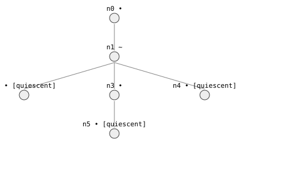

# 9. Regions and a tour of the reasoning layer

> **In this lesson:** systems that switch behavior at a threshold, and a quick
> tour of the analysis tools built on top of the simulator. This is your map
> to the rest of the library.

## Part A — Regions: piecewise systems

Real systems change their rules at thresholds. A tank *overflows* once it's
full — beyond the brim, the physics is different (excess spills; the level
holds at the top). The library models this with **operating regions**: named
subsets of constraints that are active in different parts of state space, with
guarded **transitions** between them.

Here's the bathtub upgraded so that reaching the brim *while still filling*
crosses into a steady-overflow region:

```python
import qrlib as qr
from qrlib import Qdir, TimeTag

m = qr.Model("overflow bathtub")
m.variable("amount",  landmarks=("0", "FULL"))
m.variable("level",   landmarks=("0", "TOP"))
m.variable("outflow", landmarks=("0", "OMAX"))
m.variable("inflow",  landmarks=("0", "IF"))
m.variable("netflow", landmarks=("0",), unbounded=True)

c_al  = m.constrain(qr.MPlus("amount", "level",  cvals=(("0", "0"), ("FULL", "TOP"))))
c_lo  = m.constrain(qr.MPlus("level",  "outflow", cvals=(("0", "0"), ("TOP", "OMAX"))))
c_add = m.constrain(qr.Add("netflow", "outflow", "inflow"))
c_der = m.constrain(qr.Deriv("amount", "netflow"))
c_inf = m.constrain(qr.Constant("inflow"))
c_amt = m.constrain(qr.Constant("amount"))          # amount held while overflowing

# two regions: while filling, and while overflowing
m.region("filling",     constraints=(c_al, c_lo, c_add, c_der, c_inf))
m.region("overflowing", constraints=(c_al, c_lo, c_add, c_inf, c_amt))

# cross when the tub is full *and* still gaining water
m.transition("filling", "overflowing",
             when=(("amount", "==", "FULL"), ("netflow", ">", "0")))

initial = m.state(time=TimeTag.POINT,
                  amount=("0", Qdir.INC), level=("0", Qdir.INC),
                  outflow=("0", Qdir.INC), inflow=("IF", Qdir.STD),
                  netflow=(("0", "+inf"), Qdir.DEC))

result = qr.qsim(m, initial)
print(result.stats["region_crossings"])   # 1
```



One of the behaviors now crosses regions — you can see it in the results:

```python
for b in result.behaviors():
    print(b.terminal.value, b.regions)
```

```
quiescent   ('filling', 'filling', 'filling')                  # settles below the brim
quiescent   ('filling', 'filling', 'filling', 'overflowing')   # fills, then overflows steadily
quiescent   ('filling', 'filling', 'filling')                  # settles exactly at the brim
```

The middle behavior fills, hits `FULL` while still gaining, **crosses** into
the overflow region, and there reaches a new steady state (spilling the excess
at the brim). At the crossing, magnitudes carry over continuously and only the
*directions* re-derive under the new region's rules — that's how the tub goes
from "rising" to "held at the top."

## Part B — A tour of the reasoning layer

Everything so far produces or refines a behavior graph. The library also
*reasons about* those graphs. Here are the main tools, each a few lines.
Rebuild the plain bathtub from Lessons 3–4 under unambiguous names:

```python
plain = qr.Model("bathtub")
plain.variable("amount", landmarks=("0", "FULL"))
plain.variable("level", landmarks=("0", "TOP"))
plain.variable("outflow", landmarks=("0", "OMAX"))
plain.variable("inflow", landmarks=("0", "IF"))
plain.variable("netflow", landmarks=("0",), unbounded=True)
plain.constrain(qr.MPlus("amount", "level",
                        cvals=(("0", "0"), ("FULL", "TOP"))))
plain.constrain(qr.MPlus("level", "outflow",
                        cvals=(("0", "0"), ("TOP", "OMAX"))))
plain.constrain(qr.Add("netflow", "outflow", "inflow"))
plain.constrain(qr.Deriv("amount", "netflow"))
plain.constrain(qr.Constant("inflow"))
plain_initial = plain.state(
    time=TimeTag.POINT,
    amount=("0", Qdir.INC),
    level=("0", Qdir.INC),
    outflow=("0", Qdir.INC),
    inflow=("IF", Qdir.STD),
    netflow=(("0", "+inf"), Qdir.DEC),
)
plain_result = qr.qsim(plain, plain_initial)
```

### What causes what — `analysis.causal`

Derives the causal structure from the constraints alone (no simulation):

```python
from qrlib.analysis import causal
order = causal.causal_order(plain)
print(order.exogenous)        # ('inflow',)   — the driving input
print(order.state_variables)  # ('amount',)   — the system's memory
print(causal.narrate_causes(order))
```

### What-if questions — `analysis.compare`

*Comparative analysis*: perturb a parameter and get the sign of change of
every quantity at equilibrium.

```python
from qrlib.analysis import compare
change = compare.compare(plain, {"inflow": +1})   # turn the tap up
print({k: v.symbol for k, v in change.changes.items()})
# {'amount': '↑', 'level': '↑', 'outflow': '↑', 'inflow': '↑', 'netflow': '·'}
```

Read it: raise the inflow and the equilibrium amount, level, and outflow all
rise, while the net flow stays zero (it's an equilibrium). Derived purely by
sign propagation — no numbers.

### Checking and focusing behaviors — `qrlib.guide`

First classify the complete, unguided graph. This is temporal-logic model
checking:

```python
from qrlib import guide
from qrlib.guide import G, mag

# "the amount stays below FULL forever" (a safety property)
spec = G(mag("amount", "<", "FULL"))
checked = guide.classify(plain_result, spec)
print(len(checked.satisfied), len(checked.violated), checked.universal)
# 1 2 False
```

One predicted behavior satisfies the property and two violate it, so it is not
universal over the original model. Guided simulation instead treats the
formula as an additional trajectory constraint and avoids expanding bad
prefixes:

```python
focused = guide.guided(plain, plain_initial, spec)
print(len(focused.satisfied), focused.result.stats["spec_filtered"])
# 1 2
```

The focused graph still covers every real behavior that satisfies `spec`.
Finding a satisfying qualitative path does not prove that path exists.

### Which part is broken — `qrlib.diagnosis`

*Model-based diagnosis*: give components fault modes and observations, and get
minimal explanations. Here a sensor expected to stay at `HIGH` is observed
stuck at zero:

```python
from qrlib import diagnosis
from qrlib import Landmark
from qrlib.bridge.abstraction import abstract_trajectory

sensor_model = qr.Model("sensor")
sensor_model.variable(
    "reading",
    landmarks=(Landmark("0", 0.0), Landmark("HIGH", 1.0)),
)
sensor = diagnosis.Component("sensor", modes={
    "ok": (qr.Constant("reading"), qr.At("reading", "HIGH")),
    "stuck_low": (qr.Constant("reading"), qr.At("reading", "0")),
})
observed = abstract_trajectory([[0.0]] * 20, sensor_model)
observed_initial = sensor_model.state(reading=("0", Qdir.STD))
diagnosed = diagnosis.diagnose(
    sensor_model, [sensor], observed, initial=observed_initial
)
print(diagnosed.fault_detected)                       # True
print(dict(diagnosed.diagnoses[0].modes))             # {'sensor': 'stuck_low'}
```

The normal mode is refuted because its `At(reading, HIGH)` operating point
cannot cover the observation. Diagnosis searches fault sets in increasing
cardinality and uses the coverage oracle as its consistency check.

## Where to go next

You now have the core mental model. The advanced tutorial track develops the
remaining public surfaces with runnable examples:

| Want to… | Reach for |
|---|---|
| Make models/results portable and replayable | [Lesson 10](10-portable-models.md) |
| Integrate hybrid numeric trajectories | [Lesson 11](11-hybrid-abstraction.md) |
| Learn structure and diagnose faults | [Lesson 12](12-learning-and-diagnosis.md) |
| Envision and analyze whole behavior spaces | [Lesson 13](13-advanced-analysis.md) |
| Author components and scale execution | [Lesson 14](14-composition-and-scale.md) |
| Put the complete host-facing workflow together | [Lesson 15](15-host-integration-capstone.md) |

For the design behind it all, see the top-level `docs/`: `architecture.md`
(how the pieces fit), `qsim.md` (the engine), `host-integration.md` (using the
library from a larger system), and `literature-survey.md` (where these ideas
come from).

## Exercises

1. In the region model, change the crossing guard to fire on `amount == FULL`
   *alone* (drop the `netflow > 0` condition). Does the behavior that settles
   *exactly at the brim* now wrongly cross into overflow? Why is the extra
   guard important?
2. Use `compare.compare` to predict what happens to the equilibrium level if
   you made the drain more efficient (imagine an `outflow` that rises *faster*
   with level). Sketch how you'd encode that perturbation.
3. Run both the `classify` and `guided` examples. Explain why the former says
   the property is not universal while the latter produces only one
   satisfying behavior.

---

**That's the core track.** You can now describe a system qualitatively,
simulate every behavior it admits, tame spurious clutter soundly, add numbers
for tighter bounds, and reason about causes, faults, and what-ifs. Continue
with [Lesson 10](10-portable-models.md) for the complete public-library tour.

← [Back to the index](README.md)
